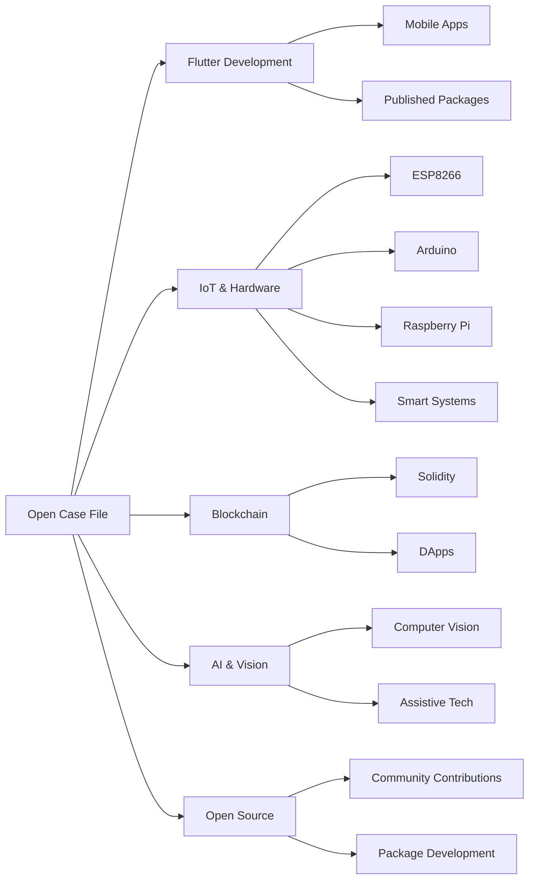

<div align="center">

```
┌─────────────────────────────────────────────────┐
│                                                   │
│   C A S E   F I L E   № 2020-FLTR                │
│                                                   │
│   STATUS:  ▓▓▓▓▓▓▓▓▓▓  ACTIVE / ONGOING          │
│   CLASSIFICATION:  UNCLASSIFIED — OPEN SOURCE    │
│                                                   │
└─────────────────────────────────────────────────┘
```

# 🕵️ THE CASE OF THE DEVELOPER


</div>

---

## 📁 SUBJECT PROFILE

```
┌──────────────────────────────────────────────────────┐
│  NAME .............. Satish Parmar                    │
│  ALIAS .............. github.com/SatishParmar1        │
│  OCCUPATION ......... Flutter Developer & Java         │
│                        Specialist                     │
│  EDUCATION .......... B.Tech, Computer Science         │
│  LAST KNOWN LOCATION  INDIA 🇮🇳         │
│  AFFILIATION ........ Open Source Contributor          │
│  ACTIVE SINCE ....... 2020                             │
│  KNOWN M.O. ......... Turns coffee into code,           │
│                        leaves bugs disguised as        │
│                        "unexpected features"           │
└──────────────────────────────────────────────────────┘
```

**Signature statement, recovered from subject's terminal history:**
> *"Code is poetry, bugs are just unexpected features."*

---

## 🔍 CASE NOTES — FIELD OBSERVATIONS

Investigators tracking the subject have logged the following recurring behavior:

| Time | Observed Activity |
|---|---|
| 06:00 | ☕ Enters premises with coffee, reviews prior night's code |
| 10:00 | 💻 Engages in prolonged build-and-debug activity |
| 17:00 | 📚 Studies unfamiliar technology, motive unclear |
| 21:00 | 🌙 Slips commits into open-source repositories under cover of night |
| Weekends | 🚀 Conducts unsanctioned "side project" experiments |

**Additional notes:** Subject claims to debug faster with `print()` than with any conventional debugger. Has allegedly assisted 100+ other developers on Stack Overflow — motive: unclear, possibly altruistic.

---

## 🗂️ CLOSED CASES — RESOLVED (published packages)

<div align="center">

*Three cases closed. Evidence available to the public on pub.dev.*

</div>

<table>
<tr>
<td width="50%" valign="top">

### 📂 CASE #001 — `page_navigation_transition`

[](https://pub.dev/packages/page_navigation_transition)
[](https://pub.dev/packages/page_navigation_transition/score)

**Verdict:** `v1.1.0` — resolved. Delivers smooth, customizable page transitions for Flutter apps.

**Evidence catalogued:**
- 🎨 Multiple transition styles: slide, fade, scale, rotate
- ⚡ Highly customizable animations
- 📱 Confirmed Navigator 2.0 compatible
- 🔧 Minimal boilerplate on record

```dart
PageNavigationTransition(
  animationType: AnimationType.slideFromRight,
  duration: Duration(milliseconds: 300),
  child: YourNextPage(),
)
```

[📄 Case File](https://pub.dev/packages/page_navigation_transition) | [⭐ Field Report](https://github.com/SatishParmar1)

</td>
<td width="50%" valign="top">

### 📂 CASE #002 — `photo_opener_view`

[](https://pub.dev/packages/photo_opener_view)
[](https://pub.dev/packages/photo_opener_view/score)

**Verdict:** `v1.1.0` — resolved. Interactive photo viewer, zoom/pan/gesture confirmed functional.

**Evidence catalogued:**
- 🔍 Pinch-to-zoom capability
- 👆 Smooth pan and swipe gestures
- 🎭 Hero animation support
- 🌙 Dark/Light mode compliance

```dart
PhotoOpenerView(
  imageUrl: 'your-image-url',
  enableZoom: true,
  backgroundColor: Colors.black,
)
```

[📄 Case File](https://pub.dev/packages/photo_opener_view) | [⭐ Field Report](https://github.com/SatishParmar1)

</td>
</tr>
<tr>
<td colspan="2" valign="top">

### 📂 CASE #003 — `smart_review_prompter`

[](https://pub.dev/packages/smart_review_prompter)
[](https://pub.dev/packages/smart_review_prompter/score)

**Verdict:** `v0.0.2` — resolved. An intelligent system that knows exactly when to ask a user for a review — and, notably, when *not* to.

**Conditions required before the subject acts (all must hold):**
```
✓ user.launchCount        ≥ minLaunchCount
✓ user.successfulActions  ≥ minSuccessfulActions
✓ daysSinceInstall        ≥ minDaysSinceInstall
✓ daysSinceLastPrompt     ≥ remindDays
✓ user.neverAskAgain      == false
```

```dart
SmartReviewPrompter.instance.init(
  minLaunchCount: 5,
  minDaysSinceInstall: 3,
  remindDays: 7,
);

if (await SmartReviewPrompter.instance.shouldPrompt()) {
  SmartReviewPrompter.instance.requestReview();
}
```

[📄 Case File](https://pub.dev/packages/smart_review_prompter) | [⭐ Field Report](https://github.com/SatishParmar1)

</td>
</tr>
</table>

<div align="center">

**Case Status:** 🟢 `All three closed and public` — new tips (contributions) welcome on every case.

</div>

---

## 🕸️ ONGOING INVESTIGATIONS


```mermaid
graph LR
    A[Open Case File] --> B[Flutter Development]
    A --> C[IoT & Hardware]
    A --> D[Blockchain]
    A --> E[AI & Vision]
    A --> F[Open Source]

    B --> B1[Mobile Apps]
    B --> B2[Published Packages]

    C --> C1[ESP8266]
    C --> C2[Arduino]
    C --> C3[Raspberry Pi]
    C --> C4[Smart Systems]

    D --> D1[Solidity]
    D --> D2[DApps]

    E --> E1[Computer Vision]
    E --> E2[Assistive Tech]

    F --> F1[Community Contributions]
    F --> F2[Package Development]
```

**Active leads the subject is currently pursuing:**
- 🏠 Smart Home IoT + Blockchain Integration
- 👁️ AI Vision Assistive Technology
- 📦 Open Source Package Development

**Open to joint investigations on:** AI-powered mobile applications · IoT integration projects · Educational tech platforms · Open source Flutter packages · Student-Alumni networking systems

---

## 🧰 EQUIPMENT INVENTORY

<div align="center">

**Primary weapons (Languages)**


**Field gear (Frameworks & Libraries)**


**Storage lockers (Backend & Database)**


**Surveillance tools (Tools & Platforms)**


**Recovered hardware (IoT)**


</div>

---

## 📈 SURVEILLANCE LOG — activity tracked over time

<div align="center">

[](https://github.com/SatishParmar1)

</div>

---

## 🔬 FORENSIC ANALYSIS — proficiency levels

<div align="center">

| Skill Under Examination | Confidence Level | Currently Investigating |
|---|---|---|
| Flutter & Dart | `███████████` 90% | Advanced State Management |
| Firebase | `████████░░░` 75% | Cloud Functions & Analytics |
| IoT | `████████░░░` 70% | ESP8266 & Arduino Integration |
| Blockchain | `█████░░░░░░` 40% | Smart Contracts & DApps |
| AI/ML | `█████░░░░░░` 40% | TensorFlow & Computer Vision |

</div>

---

## 🗞️ PRESS ARCHIVE — filed reports

<!-- BLOG-POST-LIST:START -->
- 🚀 Building Reusable Flutter Packages: A Complete Guide
- 🎨 Mastering Custom Animations in Flutter
- 🔥 Firebase + Flutter: Real-time Chat Application
- 🤖 IoT meets Mobile: Controlling ESP8266 with Flutter
- 💎 Clean Architecture in Flutter: Best Practices
<!-- BLOG-POST-LIST:END -->

---

## 📌 STILL AT LARGE — objectives for 2026

- [x] Publish 5+ Flutter packages on pub.dev
- [ ] Contribute to 10+ open source projects
- [ ] Write technical blogs and tutorials
- [ ] Master advanced Flutter animations
- [ ] Build a complete AI-powered mobile app
- [ ] Reach 1000+ GitHub stars across repositories
- [ ] Mentor aspiring Flutter developers

---

## ☎️ KNOWN ASSOCIATES — contact the tip line

<div align="center">

[](https://www.linkedin.com/in/satish-parmar-8021a5245/)
[](https://twitter.com/978satish)
[](mailto:satishparmarparmar486@gmail.com)
[](https://who-is-satish.vercel.app/)
[](https://github.com/SatishParmar1)

</div>

---

## 👁️ CASE INTEREST COUNTER

<div align="center">


</div>

---

<div align="center">

```
┌─────────────────────────────────────────┐
│   STAMP:  CASE ACTIVE — NOT CLOSED       │
└─────────────────────────────────────────┘
```

### *"Code is like humor. When you have to explain it, it's bad."* — Cory House


**Satish Parmar** — `Investigation ongoing` 🔴

</div>
