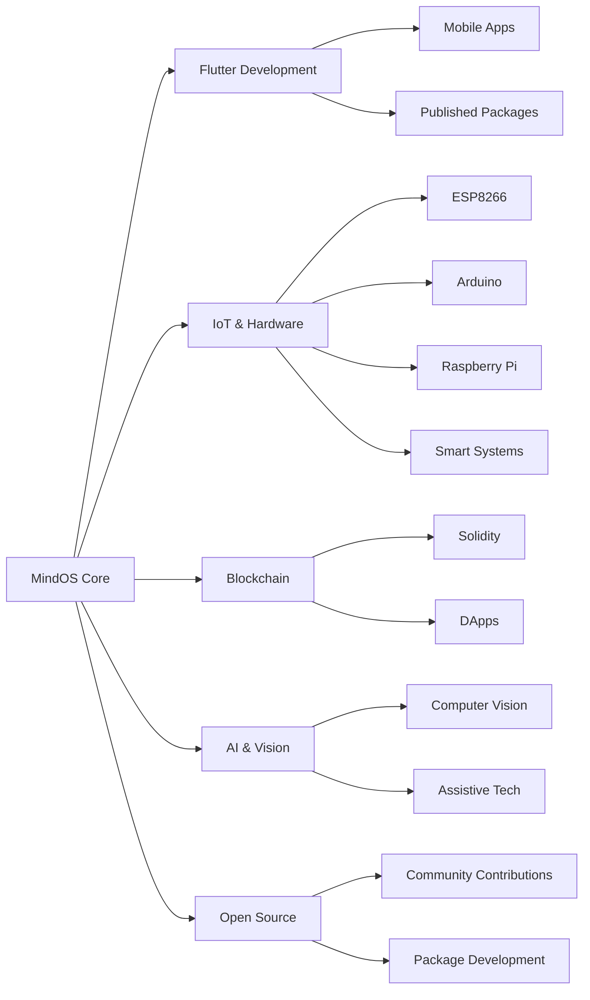

<div align="center">

```
███╗   ███╗██╗███╗   ██╗██████╗  ██████╗ ███████╗
████╗ ████║██║████╗  ██║██╔══██╗██╔═══██╗██╔════╝
██╔████╔██║██║██╔██╗ ██║██║  ██║██║   ██║███████╗
██║╚██╔╝██║██║██║╚██╗██║██║  ██║██║   ██║╚════██║
██║ ╚═╝ ██║██║██║ ╚████║██████╔╝╚██████╔╝███████║
╚═╝     ╚═╝╚═╝╚═╝  ╚═══╝╚═════╝  ╚═════╝ ╚══════╝
```

### `>_` BOOTING DEVELOPER: **SATISH_PARMAR.exe**


</div>

---

## 📟 `boot.log` — startup sequence

```bash
[   0.0001 ] MindOS v2.5.0 initializing...
[   0.0042 ] CPU: Flutter Developer Core  @ Jaipur, India 🇮🇳
[   0.0089 ] Verifying credentials......................... OK
[   0.0120 ] Loading education module...................... B.Tech CSE ✔
[   0.0450 ] Mounting /dev/flutter........................ OK
[   0.0512 ] Mounting /dev/dart........................... OK
[   0.0678 ] Mounting /dev/firebase....................... OK
[   0.0910 ] Mounting /dev/java........................... OK
[   0.1200 ] Detecting side-quests........................ IoT, Blockchain, AI/ML
[   0.3300 ] Starting service: coffee-daemon............... [ACTIVE]
[   0.5600 ] Starting service: bug-hunter.service........... [ACTIVE]
[   0.8100 ] Loading 3 packages from pub.dev............... OK
[   1.0000 ] Checking for known issues..................... none critical, only "features" 🐛
[   1.2000 ] System ready.
[   1.2001 ] Welcome back, Satish. Terminal unlocked.
```

---

## 🖥️ `neofetch` — whoami

```
       .-/+oossssoo+/-.               satish@mindos
   `:+ssssssssssssssssss+:`           -------------
 -+ssssssssssssssssssyyssss+-         OS: MindOS v2.5.0 (Flutter Edition)
.ossssssssssssssssssdMMMNysssso.      Host: Jaipur, Rajasthan, IN 🇮🇳
/ssssssssssshdmmNNmmyNMMMMhssssss/    Kernel: Dart 3.x / Java
+ssssssssshmydMMMMMMMNddddyssssssss+  Shell: Flutter & Firebase
/sssssssshNMMMyhhyyyyhmNMMMNhssssss/  Role: Flutter Developer & Java Specialist
.ssssssssdMMMNhsssssssssshNMMMdssss.  Education: B.Tech, Computer Science Engineering
+sssshhhyNMMNyssssssssssssyNMMMysss+  Company: Open Source Contributor
ossyNMMMNyMMhsssssssssssssshmmmhssso  Packages: 3 published on pub.dev (1000+ downloads)
ossyNMMMNyMMhsssssssssssssshmmmhssso  Theme: "Code is poetry, bugs are unexpected features" 🐛✨
+sssshhhyNMMNyssssssssssssyNMMMysss+
.ssssssssdMMMNhsssssssssshNMMMdssss.
/sssssssshNMMMyhhyyyyhdNMMMNhssssss/
+sssssssssdmydMMMMMMMMddddyssssssss+
/ssssssssssshdmNNNNmyNMMMMhssssss/
.ossssssssssssssssssdMMMNysssso.
 -+sssssssssssssssssyyyssss+-
   `:+ssssssssssssssssss+:`
       `.-/+oossssoo+/-.
```

---

## 🧩 `lsmod` — kernel modules loaded

```
Module              Size      State      Description
--------------------------------------------------------------
mod_flutter         active    [OK]       Mobile app engine, primary driver
mod_dart            active    [OK]       Core language runtime
mod_firebase        active    [OK]       Backend-as-a-service layer
mod_iot             loading   [~40%]     Smart Home + Blockchain integration
mod_ai_vision       loading   [~40%]     Assistive tech, computer vision
mod_opensource      active    [OK]       Package development & maintenance
```

**Currently compiling:**
- 🏠 Smart Home IoT + Blockchain Integration
- 👁️ AI Vision Assistive Technology
- 📦 Open Source Package Development

**Accepting incoming connections for:**
`AI-powered mobile apps` · `IoT integration projects` · `Educational tech platforms` · `Open source Flutter packages` · `Student-Alumni networking systems`

---

## 📦 `pub list --installed` — published packages

<div align="center">

### Contributing to the Flutter Ecosystem — 3 packages shipped, all open source

</div>

<table>
<tr>
<td width="50%" valign="top">

### 🔄 page_navigation_transition

[](https://pub.dev/packages/page_navigation_transition)
[](https://pub.dev/packages/page_navigation_transition/score)

`v1.1.0` — smooth, customizable page transition animations for Flutter apps.

```
$ pub install page_navigation_transition
Fetching...
✔ slide  ✔ fade  ✔ scale  ✔ rotate
✔ Navigator 2.0 compatible
✔ Minimal boilerplate
```

```dart
PageNavigationTransition(
  animationType: AnimationType.slideFromRight,
  duration: Duration(milliseconds: 300),
  child: YourNextPage(),
)
```

[📚 Docs](https://pub.dev/packages/page_navigation_transition) | [⭐ GitHub](https://github.com/SatishParmar1)

</td>
<td width="50%" valign="top">

### 🖼️ photo_opener_view

[](https://pub.dev/packages/photo_opener_view)
[](https://pub.dev/packages/photo_opener_view/score)

`v1.1.0` — interactive photo viewer with zoom, pan & gesture support.

```
$ pub install photo_opener_view
Fetching...
✔ pinch-to-zoom  ✔ pan/swipe  ✔ hero animation
✔ Custom UI overlay  ✔ Memory-efficient loading
✔ Dark/Light mode
```

```dart
PhotoOpenerView(
  imageUrl: 'your-image-url',
  enableZoom: true,
  backgroundColor: Colors.black,
)
```

[📚 Docs](https://pub.dev/packages/photo_opener_view) | [⭐ GitHub](https://github.com/SatishParmar1)

</td>
</tr>
<tr>
<td colspan="2" valign="top">

### ⭐ smart_review_prompter

[](https://pub.dev/packages/smart_review_prompter)
[](https://pub.dev/packages/smart_review_prompter/score)

`v0.0.2` — an intelligent in-app review prompting system that knows the perfect moment to ask for ratings.

**Trigger conditions (`if` chain):**
```
✓ user.launchCount >= minLaunchCount
✓ user.successfulActions >= minSuccessfulActions
✓ daysSinceInstall >= minDaysSinceInstall
✓ daysSinceLastPrompt >= remindDays
✓ user.neverAskAgain == false
```

```dart
SmartReviewPrompter.instance.init(
  minLaunchCount: 5,
  minDaysSinceInstall: 3,
  remindDays: 7,
);

if (await SmartReviewPrompter.instance.shouldPrompt()) {
  SmartReviewPrompter.instance.requestReview();
}
```

[📚 Docs](https://pub.dev/packages/smart_review_prompter) | [⭐ GitHub](https://github.com/SatishParmar1)

</td>
</tr>
</table>

<div align="center">

**Community Impact:** 🟢 `Active` · **Contributions:** open — PRs welcome on all three repos

</div>

---

## 🌳 `ps aux --forest` — process tree

<div align="center">


```mermaid
graph LR
    A[MindOS Core] --> B[Flutter Development]
    A --> C[IoT & Hardware]
    A --> D[Blockchain]
    A --> E[AI & Vision]
    A --> F[Open Source]

    B --> B1[Mobile Apps]
    B --> B2[Published Packages]

    C --> C1[ESP8266]
    C --> C2[Arduino]
    C --> C3[Raspberry Pi]
    C --> C4[Smart Systems]

    D --> D1[Solidity]
    D --> D2[DApps]

    E --> E1[Computer Vision]
    E --> E2[Assistive Tech]

    F --> F1[Community Contributions]
    F --> F2[Package Development]
```

</div>

---

## ⚙️ `lscpu` / hardware specs

<div align="center">

**CORE (Languages)**


**GPU (Frameworks)**


**STORAGE (Backend & DB)**


**PERIPHERALS (Tools & Platforms)**


**EXPANSION CARDS (IoT & Hardware)**


</div>

---

## 📊 `top` — live system monitor

<div align="center">

[](https://github.com/SatishParmar1)

</div>

---

## 💾 `free -h` — memory allocation by skill

<div align="center">

| Module | Allocation | Currently Buffering |
|---|---|---|
| Flutter & Dart | `███████████` 90% | Advanced State Management |
| Firebase | `████████░░░` 75% | Cloud Functions & Analytics |
| IoT | `████████░░░` 70% | ESP8266 & Arduino Integration |
| Blockchain | `█████░░░░░░` 40% | Smart Contracts & DApps |
| AI/ML | `█████░░░░░░` 40% | TensorFlow & Computer Vision |

</div>

---

## 🕒 `crontab -l` — daily scheduled tasks

```cron
06:00  ☕  /usr/bin/coffee --brew && code --review
10:00  💻  /usr/bin/build --debug --watch
17:00  📚  /usr/bin/learn --topic=new-tech
21:00  🌙  /usr/bin/git commit --open-source
SAT-SUN 🚀  /usr/bin/experiment --side-projects
```

---

## 📰 `dmesg | grep blog` — recent writes

<!-- BLOG-POST-LIST:START -->
- 🚀 Building Reusable Flutter Packages: A Complete Guide
- 🎨 Mastering Custom Animations in Flutter
- 🔥 Firebase + Flutter: Real-time Chat Application
- 🤖 IoT meets Mobile: Controlling ESP8266 with Flutter
- 💎 Clean Architecture in Flutter: Best Practices
<!-- BLOG-POST-LIST:END -->

---

## 📋 `todo.txt` — 2025 backlog queue

- [x] Publish 5+ Flutter packages on pub.dev
- [ ] Contribute to 10+ open source projects
- [ ] Write technical blogs and tutorials
- [ ] Master advanced Flutter animations
- [ ] Build a complete AI-powered mobile app
- [ ] Reach 1000+ GitHub stars across repositories
- [ ] Mentor aspiring Flutter developers

---

## 🌐 `ifconfig` — established connections

<div align="center">

[](https://www.linkedin.com/in/satish-parmar-8021a5245/)
[](https://twitter.com/978satish)
[](mailto:satishparmarparmar486@gmail.com)
[](https://who-is-satish.vercel.app/)
[](https://github.com/SatishParmar1)

</div>

---

## ⏱️ `uptime` — session counter

<div align="center">


</div>

---

<div align="center">

```
[ SIGINT received ] — session paused, not terminated.
$ echo $QUOTE
```

### *"Code is like humor. When you have to explain it, it's bad."* — Cory House


**Satish Parmar** — `MindOS session active` 🟢

</div>
