<div align="center">

# 👨‍💻 Satish Parmar

### Flutter Developer | Code Architect | Innovation Enthusiast


</div>

---


## 🌟 About Me

```typescript
class SatishParmar extends Developer {
    constructor() {
        this.name = "Satish Parmar";
        this.role = "Flutter Developer & Java Specialist";
        this.education = "B.Tech in Computer Science Engineering";
        this.location = "Jaipur, India 🇮🇳";
        this.company = "Open Source Contributor";
    }
    
    getCurrentWorkspace() {
        return {
            mainStack: ["Flutter", "Dart", "Firebase", "Java"],
            exploring: ["Blockchain", "AI/ML", "IoT", "Web3"],
            published: ["3 Flutter Packages on pub.dev"],
            currentProjects: [
                "Smart Home IoT + Blockchain Integration",
                "AI Vision Assistive Technology",
                "Open Source Package Development"
            ]
        };
    }
    
    getDailyRoutine() {
        return {
            morning: "☕ Coffee + Code Review",
            afternoon: "💻 Building & Debugging",
            evening: "📚 Learning New Tech",
            night: "🌙 Open Source Contributions",
            weekends: "🚀 Side Projects & Experiments"
        };
    }
    
    getLifeMotto() {
        return "Code is poetry, bugs are just unexpected features 🐛✨";
    }
    
    getFunFacts() {
        return [
            "🎯 Published 3 Flutter packages with 1000+ downloads",
            "⚡ Can debug faster with print() than any debugger",
            "🔥 Turned coffee into code since 2020",
            "🎮 Built my first game at age 16",
            "🤝 Helped 100+ developers through Stack Overflow"
        ];
    }
}

const me = new SatishParmar();
console.log(me.getLifeMotto());
// Output: "Code is poetry, bugs are just unexpected features 🐛✨"
```

## 🔗 Connect With Me

<div align="center">

[](https://www.linkedin.com/in/satish-parmar-8021a5245/)
[](https://twitter.com/978satish)
[](mailto:satishparmarparmar486@gmail.com)
[](https://who-is-satish.vercel.app/)
[](https://github.com/SatishParmar1)

</div>

---

## 📦 My Published Packages

<div align="center">

### 🎯 Contributing to the Flutter Ecosystem

I believe in giving back to the community. Here are my published packages available on pub.dev:

</div>

<table>
<tr>
<td width="50%" valign="top">

### 🔄 Page Navigation Transition

[](https://pub.dev/packages/page_navigation_transition)
[](https://pub.dev/packages/page_navigation_transition/score)

**Version:** 1.1.0

A powerful Flutter package that provides smooth and customizable page transition animations for your mobile applications.

**✨ Features:**
- 🎨 Multiple transition styles (slide, fade, scale, rotate)
- ⚡ Highly customizable animations
- 📱 Works seamlessly with Navigator 2.0
- 🎯 Easy integration with existing Flutter apps
- 🔧 Minimal boilerplate code

**💡 Use Cases:**
- Enhanced user experience with smooth navigations
- Creating branded app transitions
- Building professional-looking mobile apps

```dart
// Quick Example
PageNavigationTransition(
  animationType: AnimationType.slideFromRight,
  duration: Duration(milliseconds: 300),
  child: YourNextPage(),
)
```

[📚 View Documentation](https://pub.dev/packages/page_navigation_transition) | [⭐ Star on GitHub](https://github.com/SatishParmar1)

</td>
<td width="50%" valign="top">

### 🖼️ Photo Opener View

[](https://pub.dev/packages/photo_opener_view)
[](https://pub.dev/packages/photo_opener_view/score)

**Version:** 1.1.0

An interactive and feature-rich photo viewer widget with zoom, pan, and gesture support for Flutter applications.

**✨ Features:**
- 🔍 Pinch to zoom functionality
- 👆 Smooth pan and swipe gestures
- 🎭 Hero animation support
- 📐 Customizable UI overlay
- 💾 Memory efficient image loading
- 🌙 Dark/Light mode support

**💡 Use Cases:**
- Gallery applications
- Social media photo viewers
- E-commerce product images
- Portfolio showcases

```dart
// Quick Example
PhotoOpenerView(
  imageUrl: 'your-image-url',
  enableZoom: true,
  backgroundColor: Colors.black,
)
```

[📚 View Documentation](https://pub.dev/packages/photo_opener_view) | [⭐ Star on GitHub](https://github.com/SatishParmar1)

</td>
</tr>
<tr>
<td colspan="2" valign="top">

### ⭐ Smart Review Prompter

[](https://pub.dev/packages/smart_review_prompter)
[](https://pub.dev/packages/smart_review_prompter/score)

**Version:** 0.0.2

An intelligent in-app review prompting system that knows the perfect time to ask users for ratings, helping you boost your app's reviews without annoying users.

**✨ Features:**
- 🧠 Smart timing algorithms - prompts at the right moment
- 📊 Customizable trigger conditions (app launches, successful actions, time-based)
- 🎯 Non-intrusive user experience
- 📱 Native review dialogs (iOS App Store & Google Play)
- ⚙️ Fully configurable thresholds
- 💾 Persistent storage of user interactions
- 🚫 Respects user decisions (never ask again option)
- 📈 Analytics-friendly hooks

**💡 Use Cases:**
- Increasing app store ratings
- Gathering user feedback at optimal moments
- Building trust with non-aggressive prompting
- Improving app visibility through better reviews

**🎯 Smart Prompting Logic:**
```
✓ User has launched app X times
✓ User has completed Y successful actions
✓ Z days have passed since installation
✓ User hasn't been prompted in the last N days
✓ User hasn't clicked "never ask again"
```

```dart
// Quick Example
SmartReviewPrompter.instance.init(
  minLaunchCount: 5,
  minDaysSinceInstall: 3,
  remindDays: 7,
);

// Trigger when appropriate
if (await SmartReviewPrompter.instance.shouldPrompt()) {
  SmartReviewPrompter.instance.requestReview();
}
```

[📚 View Documentation](https://pub.dev/packages/smart_review_prompter) | [⭐ Star on GitHub](https://github.com/SatishParmar1)

</td>
</tr>
</table>

<div align="center">

| **Community Impact** | 🌟 Active |

**🎉 Want to contribute?** All packages are open source and accepting contributions!

</div>

---

## 🎯 What I'm Working On

```mermaid
graph LR
    A[🎯 Current Focus] --> B[Flutter Development]
    A --> C[IoT & Hardware]
    A --> D[Blockchain]
    A --> E[AI & Vision]
    A --> F[Open Source]
    
    B --> B1[Mobile Apps]
    B --> B2[Published Packages]
    
    C --> C1[ESP]
    C --> C2[Arduino]
    C --> C3[Raspberry Pi]
    C --> C4[Smart Systems]
    
    D --> D1[Solidity]
    D --> D2[DApps]
    
    E --> E1[Computer Vision]
    E --> E2[Assistive Tech]
    
    F --> F1[Community Contributions]
    F --> F2[Package Development]
```

<div align="center">



</div>

### 🤝 Open to Collaborate On

- AI-powered mobile applications
- IoT integration projects
- Educational tech platforms
- Open source Flutter packages
- Student-Alumni networking systems

---

## 💻 Tech Stack

<div align="center">

### Languages


### Frameworks & Libraries


### Backend & Database


### Tools & Platforms


### IoT & Hardware


</div>

---

## 📈 Contribution Graph

<div align="center">

[](https://github.com/SatishParmar1)

</div>

---

## 🎓 Learning Journey

<div align="center">

| Technology | Proficiency | Current Focus |
|-----------|-------------|---------------|
| Flutter & Dart | ███████████ 90% | Advanced State Management |
| Firebase | ████████░░░ 75% | Cloud Functions & Analytics |
| Blockchain | █████░░░░░░ 40% | Smart Contracts & DApps |
| AI/ML | █████░░░░░░ 40% | TensorFlow & Computer Vision |
| IoT | ████████░░░ 70% | ESP8266 & Arduino Integration |

</div>

---

## 📝 Latest Blog Posts

<!-- BLOG-POST-LIST:START -->
- 🚀 Building Reusable Flutter Packages: A Complete Guide
- 🎨 Mastering Custom Animations in Flutter
- 🔥 Firebase + Flutter: Real-time Chat Application
- 🤖 IoT meets Mobile: Controlling ESP8266 with Flutter
- 💎 Clean Architecture in Flutter: Best Practices
<!-- BLOG-POST-LIST:END -->

---

## 🎯 2025 Goals

- ✅ Publish 5+ Flutter packages on pub.dev
- 🔄 Contribute to 10+ open source projects
- 📚 Write technical blogs and tutorials
- 🎓 Master advanced Flutter animations
- 🚀 Build a complete AI-powered mobile app
- 🌟 Reach 1000+ GitHub stars across repositories
- 🤝 Mentor aspiring Flutter developers

---

## 📊 Profile Views

<div align="center">


</div>

---

<div align="center">


### ✨ *"Code is like humor. When you have to explain it, it's bad."* – Cory House

**Satish Parmar**

</div>
